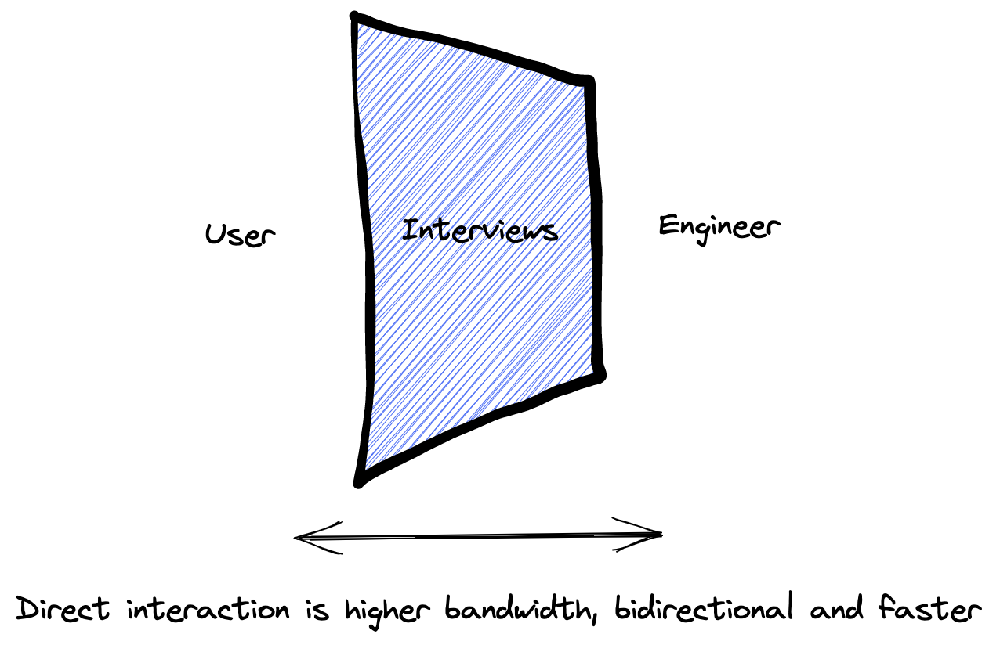
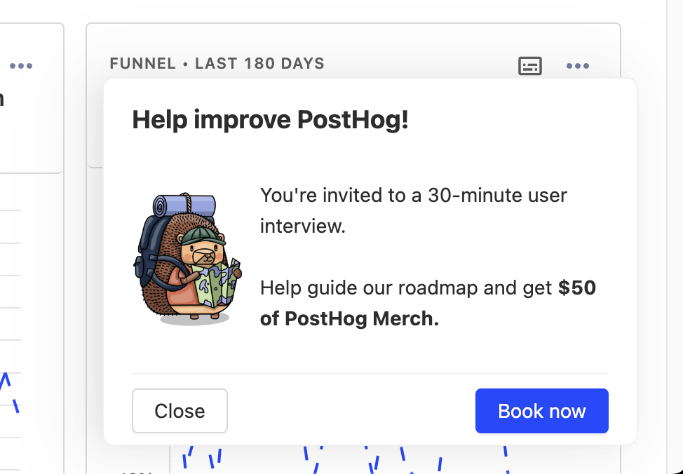

When it comes to becoming a 10x engineer, most people think about writing more code, buying more monitors, or using the latest framework where everything is a macro. But, in reality, leverage comes from choosing the right problem, building the right solution, and using the right tools. This can only happen when you have a deep understanding of your users. It's the only way to build something that people want.

## Velocity vs. Speed

```jsx
Speed = how quickly you can go from an idea to a rolled-out implementation.

Velocity = how quickly and how large an impact you can have on your users.
```

It's easy to fall into the trap of optimizing only for speed. But you might rush to implement a feature only to find no one uses it. That's why it's crucial to speak directly with your users. By understanding their pain points and needs, you can design solutions that are intuitive and effective, addressing their "hair-on-fire" problems. Moving quickly is important, but it's even more important to move quickly in the right direction.

## Reducing Information Bottlenecks: Why direct user-Engineer Interaction is Key




Traditionally, information flows from the user to the product manager (PM) by an interview and then from the PM to the engineer through a bunch of tickets. At each stage, important context is lost. It’s one way, so you can’t go deeper on the important areas.

Direct two-way interaction significantly increases the signal, enabling you to quickly cut scope, realize you’re tackling the wrong problem, or come up with a more elegant solution. PM interviews are still useful to highlight important problem areas and bring in additional context. But they are not a replacement. 

Compliment your sync interviews with async platforms like Slack for B2B or Whatsapp for B2C particularly for the solution validation phase.

## Booking user interviews: Defining segments and automating the process

To build with users, it’s crucial to develop a system to quickly speak with customers. If the friction is too high, you’ll ride an initial burst of motivation followed by regression to the old way of heads-down coding.

The first step to speaking to your users is to find them. You can define your segment using company traits, user traits, and behavioral information. A data warehouse or a product analytics tool like PostHog can be helpful here. 

Then you need to can contact them and book a time. The simplest way is to email out a Calendly link in batches via bcc’ed. But quickly you should move to an in-app prompt. We’ve seen an increase in conversion from outreach to booking by ~5x (from 3% to 16%), a reduction in email spam, and more fine-grained control of the number of bookings a week. A reward like a $30 merchandise voucher helps. 

Checkout PostHog’s [user interview app](https://posthog.com/tutorials/feedback-interviews-site-apps#setting-up-the-user-interview-app) for a quick way of showing prompts to segments of users or our [open-source set of components](https://github.com/PostHog/posthog-prompts/tree/luke/react-demo) for building your own.



## Types of user interviews: problem exploration and solution exploration

To get the most out of the interview, you should know the goal. The goal normally fits into two buckets:

### 1. Problem exploration

Find the biggest hair-on-fire problem and then deeply understand the parameters. Focus on the concrete times they’ve experienced the problem.

Example questions:
- How have they tried to solve it before? 
- What do they think of the other solutions on the market? 
- Would they pay for it? 
- Can you talk me through the last time you experienced this problem? 
- Is this actually a problem for you?

**Recommendation:** Read "The Mom Test" by Rob Fitzpatrick. It's a fantastic primer on problem exploration.

### **Solution validation: 

You’ve identified the hair-on-fire problem and understand it well. Now you’re validating whether your solution actually solves it. Focus on presenting the user with quick prototypes.

Example activities:
 - Have the user click through a Figma prototype and think out-loud. Ask them to complete the high-level goal and see where they get stuck. Ask what they think the text means.

- Send a few mockups of the solutions over Slack to the user from the problem exploration interview and ask if it solves the problem.

- Create a mock-up and see if the user will commit to paying some amount if you build it

*Recommendation:* The book "Don’t make me think" is great for usability testing.

## Beware solution ideas from users, reframe them as problems

During interviews, users will often suggest an idea for the solution of what they want. It’s crucial to not accept this at face value and instead ask “Why?” until you can reframe it as a problem with the appropriate context. 

Often the solution they propose doesn’t actually solve the problem they experienced, or there’s a much better solution that you can build instead. But most times it's not even a problem they are facing at all! Treat the solution idea as an ember and get curious about it.

## The challenge: Book a user interview this week

Across PostHog’s engineering teams we see the benefits of engineers speaking directly to users: more important problems being solved and better products being shipped. But chances are you won’t actually believe me until you’ve done a few interviews yourself and realized what someone wrote on a ticket is completely different from reality.

So here’s the challenge: **book your first user interview this week next time you’re on your computer**. *Add a reminder on your phone now*

It will take less than 15 minutes to set up. How? Create a Calendly link and connect it to your Google Meet and Google Calendar. Grab a list of 30-50 customer emails and send out the following message via bcc:

```jsx
Hi! I’m X, a software engineer at Y. I’m currently working on Z and would love your input on it. Free for a quick call at any of these times? {INSERT CALENDLY LINK} 
```

Or if there’s already a sales call or customer interview organized then ask to join and add your own questions at the end.

Have any questions, feel free to email me at {firstName}@posthog.com or DM me on [Twitter](https://twitter.com/lukeharries_).